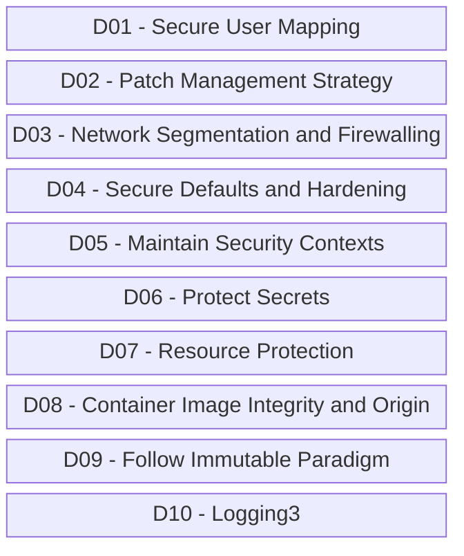

# OWASP-ApiTop10-Vulnerabilites_2024-07
Materiais de apresentação sobre OWASP API Security Top 10 realizada no dia 24/07/2024.

## OWASP API Security Top 10 2023

Riscos que fazem parte da **OWASP Top 10 API Security Risks - 2023**:

